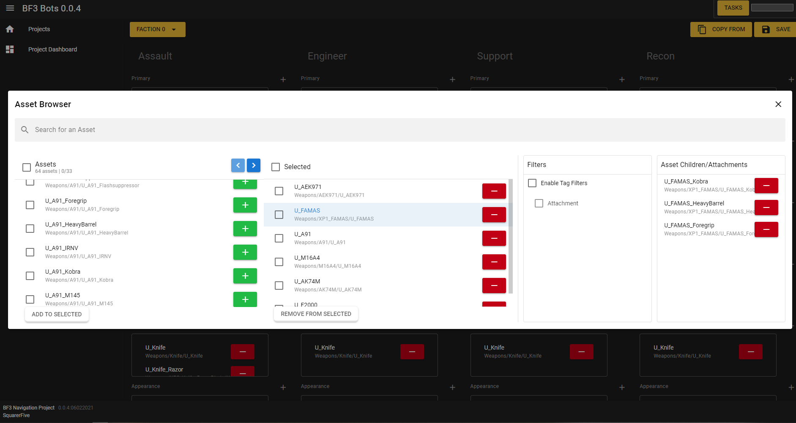

# bf3-bots
AI mod for BF3, reviving the Battlefield 2 experience.

This mod is currently in early development. Feel free to contribute but there is no guaruntee that the mod will be stable if you plan on using it (I will only be providing support for those who wish to contribute at the moment).


## Version 0.0.39 : Changelogs + Features
- Fixed: #16, #15, #9, and several bugs. Full Changelist:
```
Layered navmesh seemed to only be valid for layer 0.
Nav-mesh dimensions were inconrrect after adding a new level.
Improved the performance on AIServer by 12000%. Where it should now be in sync with the game.
Improved AI reaction times and moved compute tasks over to the startcomputetask command. Reaction times can be set using the --interval parameter.
Added the ability to set attachments for primary and secondary weapons on the bots.
Improved feedback within many UI elements, to let the user know whether a task is being run.
Bots now trace back if they are stuck on some object.
Exposed nav-mesh calculation parameters in the map editor.
AIServer is now distributable via an executable package.
Re-enabled vegetation.
Added filters to the asset browser.
Added csv tools to import and export dumped VEXT assets.
Database is now vacuumed after all tasks are deleted.
Create new arrays during the import if the nav-mesh on disk is corrupt.
Added bot driving interpolation, and vehicleController.
```
- Loadout manager, each slot contains all possible weapons - where one is randomly selected when the AI is spawned. Loadouts are set individually for each map and faction, for new maps a loadout can easily be cloned from an existing map or faction. Customize the attachments for each of the weapons.

Asset manager, where you may add a weapon from the left into the selected list, this being all possible weapons the bot could spawn with.

- AI Infantry Combat and Vehicle Driving
- Automated nav-mesh generation

- WIP Interior/Subsurface Navigation
- Working server bullet damage

## Requirements
- Battlefield 3 and Venice Unleashed

## Installation
0. You will need to open up two instances of CMD/Powershell for this.
1. Start the AI Server ```sh ./dist/AIHelper/AIHelper.exe runserver --noreload```
2. Start the AI compute background task: ```sh ./dist/AIHelper/AIHelper.exe startcomputetask```
3. Copy the directory 'bf3_bots_mod' into your BF3 server mods folder (ie, `MyServerInstance/Admin/Mods/`), then add `bf3_bots_mod` to your ModList.txt file.
4. Start your VU/BF3 server, hold down F1 in-game to focus on the UI. Create an account by registering (this is to prevent random players from messing with the settings).
5. On the top-left of the screen, open the menu and click 'Set Active' on the BF3 Bots Mod 0.0.4 project.

## System Requirements
- CPU: Intel/AMD @3.5GHz - 4 cores 8 threads minimum
- RAM: 8GB RAM, nav-mesh on large maps are at-least 512MB
- HDD: 20GB Free
- Display: 1280x720. Lower resolutions may work but it's not supported.
- Typically most mid-range hardware after 2014 should be able to run the mod.


## UI
### Notes
It is recommended to use a resolution above 1280x720.
### Contributing
- You will need NodeJS installed, then install yarn: `npm install yarn -g`
- Inside the navigation folder, run `yarn`
- Then to start it locally, run `quasar dev`
- Build it by running `quasar dev`, where the built site is located in /dist/spa/
- When compiling it with vuicc, you will need to point it to that folder.


## Features
- Flexible nav-mesh, it can be generated using a single command or use an existing one from the repo.
- Current support for up to 64 bots. (and this will increase as the mod becomes more optimized)
- AI Vehicle Interaction.
- Agnostic combat, AI see each other as normal players and will attack enemies regardless of whether they are human or bot.
- Conquest : AI attacks enemy objectives.
